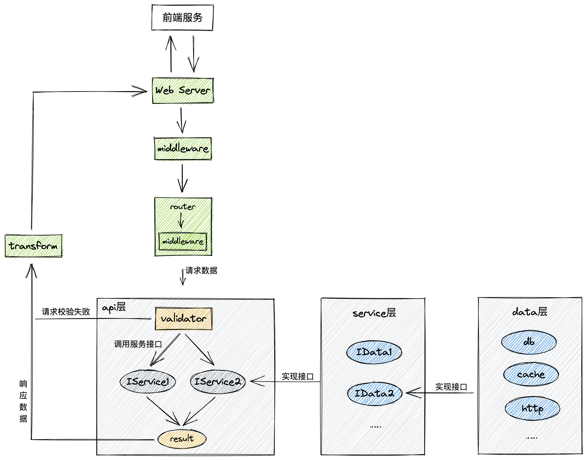

## Gin Project

docs：https://app.gitbook.com/@mittacychen/s/ego

本项目是对 Gin 的二次封装，便于快速开发业务服务

> 1. 这是一个基于 Go 语言、Gin 框架的 Web 项目骨架，对常用的库进行封装，开发者可以更快速搭建 Web 服务，更关注属于自己的业务
> 2. 项目要求 Go 版本 >= 1.15
> 3. 拉取本项目骨架，在此基础上就可以快速开发自己的项目

### 1. 项目架构



- middleware：全局中间件，所有路由都会经过这些中间件

- router 层：定义路由，调用 api 层各个方法。每个路由也可以有自己的中间件。

- api层：可以包含一个或多个 service 接口，相关的服务应该放在同一个服务接口中

    1. 调用 validator 层的请求结构体，解析请求参数，如果失败直接返回结果；
    2. 调用 service 服务，获得返回结果；
    3. 调用 transform 对响应数据进行处理，然后响应给前端

- service 层：实现 api 层定义的 service 接口，一个 service 结构体可以实现多个 api 层定义的服务接口

    service 包含一个或多个 data 接口，相关的数据操作应该放在同一个 data 接口中

- data 层：实现 service 层定义的 data 接口，一个 data 结构体可以实现多个 service 层定义的 data 接口

    涉及数据的查询和持久化都应该在这个层实现，包含 db处理、缓存处理或者 http请求其他服务等

### 2. 项目结构

```shell
├── bootstrap               # 初始化顺序调用封装
│   └── init.go
├── apierr                  # 服务错误码和错误定义
│   ├── code.go
│   └── err.go
├── pkg                     # 各种工具封装
│   ├── checker             # 校验器封装
│   │   └── validator.go
│   ├── config				# 配置全局初始化、配置结构
│   │   ├── init.go
│   ├── jwt
│   │   └── token.go
│   ├── logger				# 日志封装
│   │   ├── init.go
│   │   ├── mylogger.go
│   │   ├── struct.go
│   │   └── zap.go
│   ├── response			# 响应封装
│   │   ├── response.go
│   │   └── utils.go
│   └── store
│       ├── cache			# 缓存封装
│       │   ├── config.go
│       │   ├── custom.go
│       │   └── redigo.go
│       └── db				# 持久化封装
│           ├── config.go
│           └── gorm.go
├── app
│   ├── validator           # 数据请求、响应结构体定义以及参数校验
│   │   └── userValidator
│   │       └── user.go
│   ├── transform			# 响应数据处理、封装
│   │   └── user.go
│   ├── api                 # api控制器，这里只进行请求解析、service编排与调用
│   │   └── user.go
│   ├── service             # 服务层，处理逻辑，实现api中各个服务接口
│   │   └── user.go
│   ├── data                # 数据存储层，实现service中各个data接口
│   │   └── user.go
│   └── model               # 定义与数据库的映射结构体
│       └── user.go
├── middleware              # 中间件
│   └── core.go
├── router
│   ├── custom_wire.go		# ego生成的api控制器创建函数，自定义控制器创建函数也写在这里
│   ├── router.go			# 路由初始化
│   ├── wire.go				# 依赖注入，生成各种api控制器创建函数
│   └── wire_gen.go
└── utils                   # 工具封装
│   └── err.go
├── logs                    # 日志文件目录
│   ├── err
│   │   └── default.log
│   └── info
│       └── default.log
├── default.yaml
├── go.mod
├── go.sum
├── main.go
```

## 快速开始

### 1. 前期准备

+ 安装go环境，version >= 1.15
+ 安装Mysql（如果需要）
+ 安装Redis（如果需要）

### 2. 修改配置文件

配置文件位于项目根目录 `default.yaml`，修改对应的配置信息：

+ server 服务端口
+ mysql 地址、用户名、密码
+ redis

### 3. 启动服务

```shell
$ cd myProjectName
$ go mod download
$ go run main.go -config default.yaml
```

> -config 参数，配置文件路径，默认为 `default.yaml`

