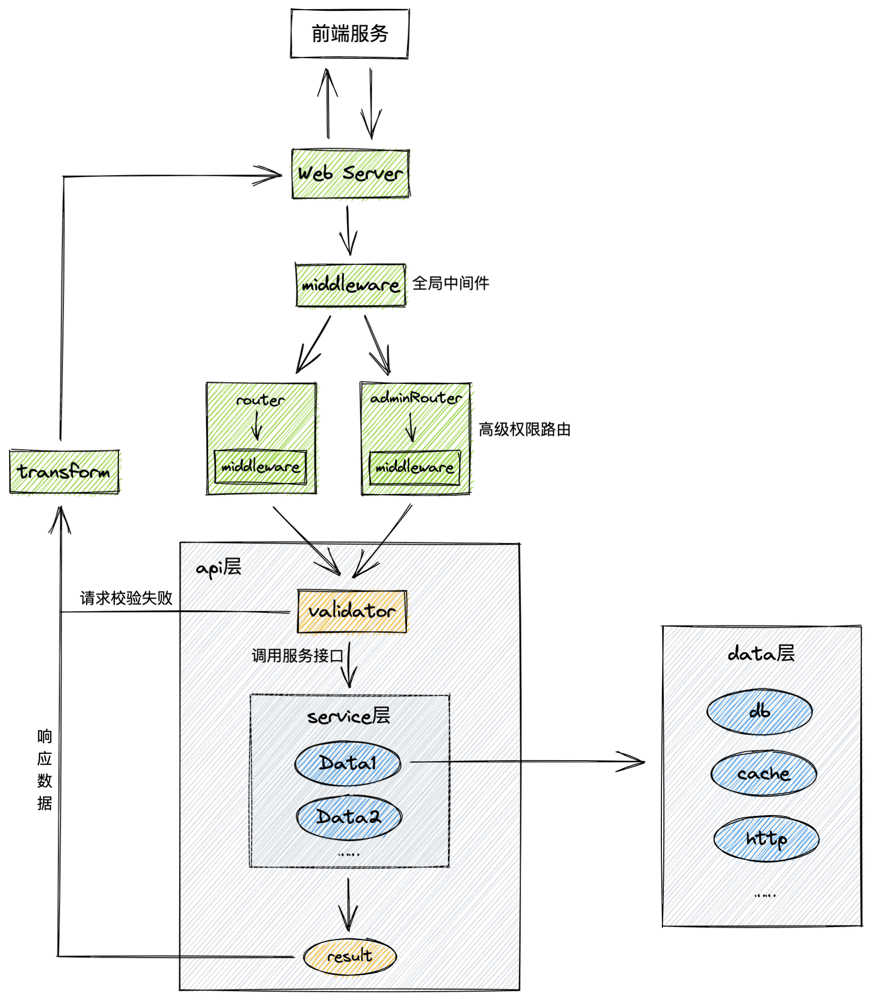

## ego layout

docs：http://www.mittacy.com/column/1633512445750

本项目是对 Gin 的二次封装，便于快速开发业务服务

> 1. 这是一个基于 Go 语言、Gin 框架的 Web 项目骨架，对常用的库进行封装，开发者可以更快速搭建 Web 服务，更关注属于自己的业务
> 2. 项目要求 Go 版本 >= 1.15
> 3. 拉取本项目骨架，在此基础上就可以快速开发自己的项目

### 1. 项目架构



- middleware：全局中间件，所有路由都会经过这些中间件
- router 层：定义路由，调用 api 层各个方法。每个路由也可以有自己的中间件。**建议分成两部分，高级权限的路由统一前缀管理，防止调用错路由**
- api层：可以包含一个或多个 service

    1. 调用 validator 层的请求结构体，解析请求参数，如果失败直接返回结果；
    2. 调用一个或多个 service 服务，获得返回结果；
    3. 调用 transform 对响应数据进行处理，然后响应给前端
- service 层：service 包含一个或多个 data
    1. 处理各种逻辑
    2. 调用一个或多个 data 方法存储或查询数据
- data 层：包含db、cache、http远程调用服务等，涉及数据的查询和持久化都应该在该层实现


### 2. 项目结构

```shell
├── bootstrap					# 初始化顺序调用封装
│   └── init.go
├── apierr						# 服务错误码和错误定义
│   ├── code.go
│   └── err.go
├── pkg							# 各种外部工具封装
│   ├── cache					# 缓存封装
│   │   ├── config.go
│   │   └── redis.go
│   ├── config					# 配置全局初始化、配置结构
│   │   └── viper.go
│   ├── log						# 日志封装
│   │   ├── biz.go
│   │   ├── config.go
│   │   ├── log.go
│   │   ├── zap.go
│   │   └── zap_test.go
│   ├── mysql					# mysql封装
│   │   ├── config.go
│   │   └── gorm.go
│   └── response				# 响应封装
│       ├── log.go
│       ├── response.go
│       └── validator.go
├── app							# 对外服务
│   ├── adminApi				# 高级权限路由
│   │   └── user.go
│   ├── api						# 普通权限路由
│   │   └── user.go
│   ├── job						# 流式任务处理
│   └── task					# 定时任务
├── internal					# 内部服务
│   └── validator				# 数据请求、响应结构体定义以及参数校验
│       └── userValidator
│           └── user.go
│   ├── transform				# 响应数据处理、封装
│       └── user.go
│   ├── service					# 服务层，处理逻辑
│       └── user.go
│   ├── data					# 数据查询、存储层
│       └── user.go
│   ├── model					# 定义与数据库的映射结构体
│       └── user.go
├── middleware              	# 中间件
└── router						# 路由
│   ├── admin.go
│   ├── request.go
│   └── router.go
├── Makefile
├── main.go
```

## 快速开始

### 1. 前期准备

+ 安装go环境，version >= 1.15
+ 安装Mysql（如果需要）
+ 安装Redis（如果需要）

### 2. 修改配置信息

配置文件位于项目根目录 `.env.development`，修改对应的配置信息：

+ 服务信息
+ mysql信息
+ redis信息

### 3. 启动服务

#### 3.1 使用命令启动

```shell
$ cd myProjectName
$ go mod download
$ go run main.go -config .env.development -env development -port 8080
```

> -config 参数，配置文件路径，默认为 `./.env.development`
>
> -env 服务运行环境，development/test/production
>
> + development 会将日志同步打印到控制台
> + test/production 不会将日志打印到控制台，正式环境应该设置为 production
>
> -port 服务端口，默认为 10244

#### 3.2 使用 Makefile

进入Makefile修改响应配置：

```shell
SERVER = ego-layout
CONFIG = .env.development
PORT = 10244
ENV = release
```

启动服务

```shell
$ make clean

# 启动服务
$ make start

# 优雅重启服务，不间断服务，脚本中的xargs命令格式只支持在 linux 运行
$ make restart

# 停止服务，脚本中的xargs命令格式只支持在 linux 运行
$ make stop
```

### 4. 生成业务框架代码

```shell
# 安装 ego 工具
$ go get -u github.com/mittacy/ego@latest

# 进入项目根目录
$ ego new project
$ cd project

# 创建 api、validator、transform、service、data、model 代码模板
$ ego tpl api article

# 创建 service、data、model 代码模板
$ ego tpl service article

# 创建 data、model 代码模板
$ ego tpl data article

# 创建定时任务 task 代码模板
$ ego tpl task notice
```

